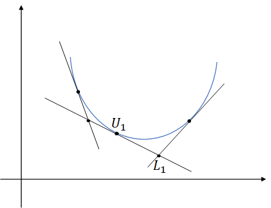

# 切平面算法

切平面算法是对凸函数的一种寻找极值的优化的算法，通过不断的构造平面逼近目标函数来求取极小值

# 原理

设对于所有属于凸函数定义域（凸集）的 **x** ，目标函数 **f** 也是凸的。

假设之前已经选取了 **k** 个参数向量 $x_1,x_2,...,x_k$ ，且已经计算了这些点的函数值 $f(x_1),...,f(x_k)$ 以及它们的次梯度 $\nabla f(x_1),...,\nabla f(x_k)$ ，因为函数是凸的，所以这些点的泰勒展开的一次项（次梯度是小于等于当点的梯度），可以得到
$$
f(x) \geq f(x_i) + \nabla f(x_i)(x-x_i)
$$
 （以二阶函数作图示例）

在二次优化中，次梯度就为该点的切线方向

所以对于凸函数中所有的 **x** 来说

